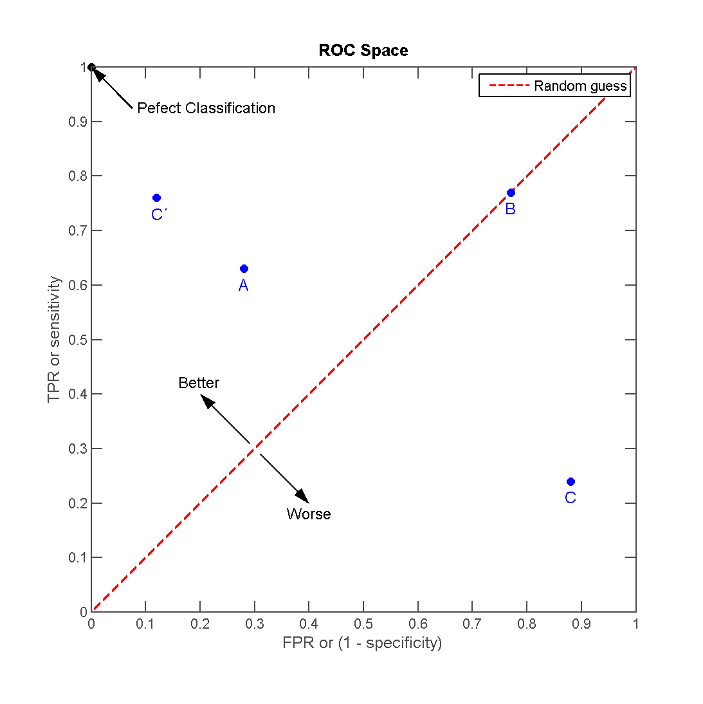

## Overview

This blog serves as the reference material for our workshop on using caret for machine learning workflow in R.  

More importantly, this blog is maticulously designed so as to be an all encompassing post about using caret as your first angle of attack for supervised learning.  

Because of this I have designed each section to be wholly independent and address a specific use case. I also highlight some intuition throughout the post but most intuition will be caught, and not taught, during the workshop.  

## libraries

These are the basic libraries you will need. If you are not familiar with any of these I suggest you at least read through their documentation to understand the role of each:  

```{r}
library(tidyverse)
library(magrittr)
library(caret)
library(rsample)
library(recipes)
library(yardstick)
library(tidyposterior)
library(parallel)
library(plotROC)
library(DMwR)
library(ROSE)
```

In a broad sense we will cover many of the packages developed by Max Khun and Hadley Wickham. To read the excellent source material on these packages please see the pkgdown websites:  

- <https://topepo.github.io/caret/index.html>  
- <https://tidymodels.github.io/recipes/index.html>  
- <https://tidymodels.github.io/rsample/index.html>  
- <https://tidymodels.github.io/tidyposterior/index.html>  
- <https://tidymodels.github.io/yardstick/>  

## Introduction: So you don't know caret?

Caret is short for _C_ lassification _A_ nd _RE_ gression _T_ raining. In other words caret is an umbrella SDK for supervised machine learning development.  

Unlike its counter part scikit-learn, caret was not intentionally developed as an object oriented tool with strict rules for adding models. What caret does is try to enforce this, creating a common API workflow to leverage existing statistical models in R.  

Caret tries to make all the power and variety of R's extensive statistical libraries accessible and standardized by writing a unified api to communicate with those packages.  

### Minimalist examples for beginners

Caret has a few heavy lifters we make use of:  

- train()  

This is the main function. The train function (much like scikit-learn) is able to use data and a specified model name to train and learn to classify or predict outcomes it sees in the data.  

For example if we look at the following toy dataset:  

```{r}
# url="http://freakonometrics.free.fr/german_credit.csv"
# credit=read.csv(url, header = TRUE, sep = ",")

## Should have this data with caret:
data("GermanCredit")

 GermanCredit <- 
  GermanCredit %>% tbl_df %>% 
   sample_frac(0.1)

GermanCredit %>% glimpse
```

Here we have bank data on users and their credit holdings. Let's train a random forest model to predict their `Amount` using all the other variables:  

```{r}
random_forest_model <- 
  train(form = Amount~.,data = GermanCredit,method = "rf")
```

When we don't specify anything the train function will try setting a few hyper parameters to find an optimum model. It will also use bootstrapping during training to validate the model (it will sample random entries for training and use the holdout set for validation).

If we print the train object it will show us a summary of the training result:  

```{r}
random_forest_model
```

If we plot the object it gives us the performance of the training over all the different hyper parameters it tried:  

```{r}
random_forest_model %>% plot
```

The train object also stores all its parts inside list elements. For example we can extract the actual model object:  

```{r}
random_forest_model$finalModel
```

- trainControl(classProbs = TRUE, summaryFunction = twoClassSummary,savePredictions = TRUE)  

This function is used to specify any needed sampling techniques when training on the data. For example:  

```{r}
train(form = Amount~.,data = GermanCredit,method = "rf", trControl = trainControl(method = "LOOCV"))
```

Setting this control in the train function will tell the trainer to use leave one out cross-validation with 4 folds and to predict probabilies in a classification model.  

Furthermore for classification models we can tell the trainer to summarise the metrics for a 2 class binary classification (ROC etc.), keep predictions or to predict probabilities by default  

- tuneGrid =  

We can provide the train function with an expand grid of all the parameters we want to optimize as well as values of these we want to try.  

Here is an example grid where we try values for the parameters `size` and `k`:  

```{r}
grid <- expand.grid(size=c(5,10,20,50), k=c(1,2,3,4,5))

grid
```

And we can pass this to train:  

```{r, eval=F}
train(form = Amount~.,data = GermanCredit,method = "rf", tuneGrid = grid)
```

The trainer will try every combination of these values to find the optimal model. Of course in this case we are training a random forest model which only has parameters mtry (number of features to consider over partitions)

- preProcess =  

The preProcess will transform the data for you to prepare it for the model:  

```{r}
train(form = Amount~.,data = GermanCredit,method = "rf", preProcess = c("center", "scale", "YeoJohnson", "nzv"))
```

In this example train will center and scale the data after applying YeoJohnson transformation on all the variables and removing near zero variance columns. Note that in this case it did not improve the model (but may improve if we were to fit a linear model for example)

- importance = TRUE  

This will make sure the train object keeps importance calculations for variable importance plots  

We can also pass any parameters to the underlying package by passing them as extra arguments in the `train()` function.

## Data transformation and preparation - recipes

The recipes package is an attempt to standardize all data treatment prior to model training. Much like the rsample and caret package this library wants to be a rich and compatible way to build your own machine learning workflows.  

Recipes is the standalone counterpart library of the backend used by caret to perform things like `sample = c("down")`. The difference is that caret will directly call the underlying library that does this (like DmWR), whereas recipes gives us a maintained and standardized library for all these different transformations.

> Intuition - Splitting data for training.  
When we prepare the data for training a model we often want to hold out some data for validating our model later. Usually we split the data into a training set and a validation set. The validation set is used to make sure our model accuracy is consistent. When the validation accuracy gets worse after tuning the model parameters we have started over fitting the training data and the model will not generalize well. When we intend to tune the model parameters a lot it is normal to hold out a 3rd set for testing in case our iterations of optimization have leaked information about the test set.  


So why a recipe? If all I want to do is transform the data a bit, I can do that myself?  

This is true. But as you will find; it is easy to run into some simple issues with even the most basic of transformations.  

For example; I say I want to centre and scale the data. I do so and then I split the data into training and testing sets. I realize that transforming the training data using features from the test data like outliers has leaked signal that I did not intend to leak. I correct this; I split the data first... I realize that applying the function to both sets will scale the 2 sets differently.  

You can see how things can get tricky. More than this the package also has exceptional functions for just about anything you could possibly want to do with the data before your training.  

For a list of the possible transformations please look at <https://tidymodels.github.io/recipes/reference/index.html>  

Why not just use caret's preProcess parameter? This is a very good way to do the same things (in most cases), but this won't allow you the freedom you always need. For example if you only wanted to pca certain variables or you never intended to transform the variables for train but for a different function instead like MFA().  

For selecting the groups of variables for which each step applies use the following:  
- all_nominal() : this is categorical/factor variables  
- all_outcomes() : can have multiple predictors  
- all_predictors()  
- all_numeric()  
- has_type()
- contains()  
- matches()  
- num_range()  
- one_of()  
- everything()  
- ends_with()  

### Intuition example:  

The iris dataset is a very common introduction dataset for classification. The data summarizes the physical properties of plant species (of the iris flower). By using these features we can try to predict the species of iris we are dealing with:  

```{r}
dataset <- iris

dataset %>% head
```

We use the handy caret function to create a data partition optimizing over each class:  

```{r}
data_partition <- createDataPartition(y=dataset$Species, p=0.75, list=FALSE)

train <- dataset[data_partition,]
test <- dataset[-data_partition,]

list(train,test) %>% map(dim)

```

Note this is the same idea as grouping by each class and using `dplyr::sample_frac()`.  

Now we create a recipe of steps  

```{r}
rec_obj <-
  recipe(Species~.,data=train) %>%
  step_corr(all_numeric(),threshold = 0.9) %>%
  step_nzv(all_numeric()) %>%
  step_naomit(everything()) %>%
  step_center(all_numeric()) %>%
  step_scale(all_numeric())

prepped_rec <-
  rec_obj %>%
  prep(training = train)

# train(rec_obj,data = train,method = "knn")

train <-
  prepped_rec %>%
  bake(newdata = train)

test <-
  prepped_rec %>%
  bake(newdata = test)

train %>% head

iris_knn <- 
  train(form = Species~.,data = train, method = "knn")

iris_knn
```

Note that when training a classification model we will be shown the accuracy and kappa measurements. It's very important to make sure these measurements are almost the same. The kappa statistic is designed to penalise accuracy based on the bias recall trade-off of false positives and negatives. When we see a kappa that is much lower than accuracy it usually suggests a class imbalance.  

When dealing with classification models it is often helpful to look at the confusion matrix:  

```{r}
confusionMatrix(iris_knn)
```

This matrix is simply the cross-tabulation of the predicted class vs. the actual class. In caret's case it calculates this as a proportion within each sampled dataset and averages it out. In general the accuracy can be interpreted as the sum of the diagonal of the confusion matrix (the true predictions) divided by the sum of the entire matrix (number of predictions):  

```{r}
manual_confusion_matrix <- 
  table(iris_knn %>% predict(newdata=iris),
      iris$Species)

manual_confusion_matrix
```

And to show calculation metrics intuition:  

** accuracy **  

```{r}
manual_confusion_matrix %>% diag %>% sum / sum(manual_confusion_matrix)
```

** precision **  

The precision calculates the accuracy of the relevant class of interest. If we want to identify versicolor iris flowers our precision can be calculated as the sum of correct versicolor predictions divided by total versicolor predictions:  

```{r}
manual_confusion_matrix[2,2] / manual_confusion_matrix[2,] %>% sum
```

** recall **

The recall score is the number of relevant predictions out of all relevant outcomes:  

```{r}
manual_confusion_matrix[2,2] / manual_confusion_matrix[,2] %>% sum
```

Note that these are for intuition and that the `yardstick` package can calculate all of this and more for us.  

### Practical example:  

Let's look at a different dataset and train without any transformations:  

Load data  

```{r}
data(cox2)

cox2 <- cox2Descr
cox2$potency <- cox2IC50

```

Train a glm to predict potency  

```{r}
set.seed(8020)
cox2_glm <- train(form = potency ~ ., 
                 data = cox2,
                 method = "glm", 
                 trControl = trainControl(method = "cv",number = 5))

cox2_glm
```

What went wrong!? The problem is we loaded the data and fit a model on it without scrubbing the data first. There could be many NA values, correlated columns, zero variance columns and so on... If we look at the dimensions of the data we see it has `r cox2 %>% dim()` rows and columns. That's a lot of room for error...  

Using a recipe we can alleviate some common issues:  

```{r}

cox2_recipe <- recipe(potency ~ ., data = cox2) %>%
  step_log(potency, base = 10) %>%
  step_nzv(all_predictors()) %>%
  step_pca(contains("VSA"), prefix = "surf_area_", 
           threshold = .95) %>%
  step_corr(all_predictors(), -starts_with("surf_area_"), 
            threshold = .90) %>%
  step_center(all_predictors(), -starts_with("surf_area_")) %>%
  step_scale(all_predictors(), -starts_with("surf_area_"))

set.seed(8020)
cox2_glm <- train(cox2_recipe, 
                 data = cox2,
                 method = "glm", 
                 trControl = trainControl(method = "cv",number = 5))

cox2_glm
```

Here we tell the pipeline to log our outcome variable, remove near zero variance columns, perform a pca on all VSA variables (that have over 95% correlation), remove any remaining variables with over 90% correlation and lastly center and scale the data (except for the pca variables that are scaled already). As per usual we also tell the model to use 5 fold cross-validation.  

## Dealing with class imbalances

A class imbalance occurs in classification problems where the interesting class we want to predict is vastly under represented in our data. The classification model would ideally prefer equally prevalent classes to train on. When class imbalance exists in our outcome the model is given many counter examples for each interesting case and it becomes hard for the model to optimize its loss function.  

After all, the model will gain accuracy at a low cost if it simply predicted everything as the majority class!  

### Load some data:  

```{r}
path = "https://community.watsonanalytics.com/wp-content/uploads/2015/03/WA_Fn-UseC_-Telco-Customer-Churn.csv?cm_mc_uid=58920755505115141495567&cm_mc_sid_50200000=1514149556&cm_mc_sid_52640000=1514149556"
db_churn = read_csv(path)

db_churn %>% glimpse
```

### Prepare data recipe

```{r}

IDs <- db_churn$customerID

db_churn %<>% select(-customerID)

rec_obj <-
  recipe(Churn~.,data=db_churn) %>%
  step_corr(all_numeric(),threshold = 0.9) %>%
  step_nzv(all_numeric()) %>%
  step_naomit(everything()) %>%
  step_center(all_numeric()) %>%
  step_scale(all_numeric())

rec_obj <- 
rec_obj %>% prep(newdata=db_churn,retain = TRUE)
```


### Train a vanilla model

```{r}

ctrl = trainControl(method = "cv", number=5,classProbs = TRUE, summaryFunction = twoClassSummary,savePredictions = TRUE)

churn_model <- 
  train(rec_obj,method="rf",data = juice(rec_obj),trControl = ctrl)

churn_model
```

### Confusion matrix

```{r}
churn_model %>% confusionMatrix()
```

### ROC curves

An ROC curve shows us the tradeoff between precision and sensitivity in our models for the outcome of interest.  

```{r,include=F,eval=F}
download.file(url = "https://upload.wikimedia.org/wikipedia/commons/3/36/ROC_space-2.png?download",destfile = "static/Pictures/caret_workshop/ROC_curve.png")
```

<!--  -->


Let's plot our ROC curve for this model:  

```{r}
selectedIndices <- churn_model$pred$mtry == 2

ggplot(churn_model$pred[selectedIndices, ], aes(m=Yes, d=factor(obs))) + 
  geom_roc(n.cuts=0) + 
  coord_equal() +
  style_roc()+
  ggtitle("Receiver operating characteristic curve",subtitle = "Outcome of interest: Churn = Yes")
```

### Now adressing class imbalance

Sice we are primarily concerned with predicting churners we want to possibly maximise the true "Yes" prediction even at the cost of some false positive "Yes" predictions. To do this we use some sampling strategies that address class imbalances:  

Down sample majority class : `sampling = "down"`   
Up sample minority class : `sampling = "up"`  
Create synthetic minority class examples : `sampling = "smote"`  
Smoothed bootstrap approach : `sampling = "rose"`  

Here we retrain our model on the churn data while using the ROSE sampling strategy to increase precision at the cost of some sensitivity:  

```{r}

ctrl = trainControl(method = "cv", number=5,classProbs = TRUE, summaryFunction = twoClassSummary,savePredictions = TRUE,sampling = "rose")

churn_model <- 
  train(rec_obj,method="rf",data = juice(rec_obj),trControl = ctrl)

churn_model
```

Now let's look at the confusion matrix once more:  

```{r}
churn_model %>% confusionMatrix()
```

We can tell our precision has gone up quite a bit which allows us to pick up more of the cases where people actually churned, but this happened at the cost of correctly predicting when we people will not churn (since we now are more likely to predict they will churn).  

```{r}
selectedIndices <- churn_model$pred$mtry == 2

ggplot(churn_model$pred[selectedIndices, ], aes(m=Yes, d=factor(obs))) + 
  geom_roc(n.cuts=0) + 
  coord_equal() +
  style_roc()+
  ggtitle("Receiver operating characteristic curve",subtitle = "Outcome of interest: Churn = Yes")
```

We can tell from the ROC curve that our overall trade-off is about the same even though we have improved our precision in the model. This means our trade-off was very efficient. We may even be comfortable with upscaling the ROSE sampling in our model to squeeze out that last 25% of predictions.  

## Training multiple models using multiple cores

As with finance; many people believe in the principle of no arbitrage. In simple terms this means that you don't really know the best model and parameters for the data problem until you've tried them all.  

Because of this it is very useful to have a framework for testing many different models on the data. This will help you build up an intuition for choosing appropriate models.

Let's demonstrate this using our trusty BostonHousing dataset:  

```{r}
data(BostonHousing2)
dataset <- BostonHousing2 %>% tbl_df() %>% na.omit()

dataset %>% head()
```

We will try to predict the crime rate per capita by training a model

### Split test train

```{r}
data_partition <- dataset %>% initial_split(prop = 0.8)

train <- data_partition %>% training()
test <- data_partition %>% testing()

```

### Build model framework  

```{r}
train_data <-
    tibble(model = c("rf","cubist","glm"),data = list(train))

```

### Train models on 4 cores:  

```{r}
set.seed(8020)
cl = makeCluster(4)
doParallel::registerDoParallel(cl)

system.time({
model_frame <- train_data %>%
  mutate(caret_models = map2(.x = model,.y=data,~train(form = crim~., data = .y,method = .x,importance = TRUE))) %>% 
  mutate(RMSE = caret_models %>% map_dbl(~.x %>% pluck("results","RMSE") %>% min)) %>% 
  mutate(MAE_res = caret_models %>% map_dbl(~.x %>% pluck("results","MAE") %>% min))
})

stopCluster(cl)

model_frame
```

To inspect the models themselves we can simply print the models:  

```{r}
model_frame$caret_models
```

### Variable importance plots:  

We can compare for example the cubist and glm models by looking at the variables used to make the prediction  

```{r}
caret::varImp(model_frame$caret_models[[2]]) %>% plot
```


```{r}
caret::varImp(model_frame$caret_models[[3]]) %>% plot

```

This will help you scrutinize the model and can help choose the optimal model  

## Using rsample for bootstrapping/crossvalidation

Up to now we have taken more control over the scrubbing and transforming of input data. Now we will do the same by taking control of the sampling strategies together with recipes.  

From the official website:  

> rsample contains a set of functions that can create different types of resamples and corresponding classes for their analysis. The goal is to have a modular set of methods that can be used across different R packages for:  

>traditional resampling techniques for estimating the sampling distribution of a statistic and
estimating model performance using a holdout set
The scope of rsample is to provide the basic building blocks for creating and analyzing resamples of a data set but does not include code for modeling or calculating statistics. The “Working with Resample Sets” vignette gives demonstrations of how rsample tools can be used.  

Sampling tecniques available in this package:  

- initial_split() training() testing() : Simple Training/Test Set Splitting  
- bootstraps() : Bootstrap Sampling  
- vfold_cv() : V-Fold Cross-Validation  
- loo_cv() : Leave-One-Out Cross-Validation  
- mc_cv() : Monte Carlo Cross-Validation  
- group_vfold_cv() : Group V-Fold Cross-Validation  
- rolling_origin() : Rolling Origin Forecast Resampling  
- nested_cv() : Nested or Double Resampling  
- apparent() : Sampling for the Apparent Error Rate  

### Create training and validation 

```{r}
# dataset <- iris
dataset <- recipes::okc

dataset %>% head
```

```{r}
bt_samples <- bootstraps(dataset,times = 5)
bt_samples
```

### Define recipe to be applied to each of the folds

```{r}
rec_obj <-
  recipe(diet~.,data=dataset) %>%
  # step_knnimpute(everything()) %>% 
  step_naomit(everything()) %>% 
  step_center(all_numeric()) %>%
  step_scale(all_numeric())
```

```{r}
# bt_samples$recipes <- map(bt_samples$splits, prepper, recipe = rec, retain = TRUE, verbose = FALSE)

bt_samples <- 
  bt_samples %>% 
  mutate(prepared_recipe = splits %>% map(~.x %>% prepper(recipe = rec_obj, retain = TRUE, verbose = FALSE)))

bt_samples
```

### Train model on each of the prepared recipes

```{r}

set.seed(8020)
cl = makeCluster(4)
doParallel::registerDoParallel(cl)

system.time({
bt_samples <- 
  bt_samples %>% 
  mutate(models = prepared_recipe %>% map(~train(form = diet~.,data = juice(.x),method = "rf")))
})

stopCluster(cl)

bt_samples
```

### Make predictions using each fold's validation data

```{r}
bt_samples <- 
  bt_samples %>% 
  mutate(validated_predictions = pmap(list(splits,prepared_recipe,models),~bake(..2,assessment(..1)) %>% predict(object =..3))) %>% 
  mutate(validated_predictions_prob = pmap(list(splits,prepared_recipe,models),~bake(..2,assessment(..1)) %>% predict(object =..3,type="prob")))

bt_samples
```

### Calculate performance metrics using our bootstrapping

```{r}

bt_samples <- 
  bt_samples %>%
  mutate(assessment_truth = splits %>% map(~assessment(.x) %>% pull(Species))) %>% 
  mutate(accuracy = pmap_dbl(list(splits,validated_predictions),~tibble(Truth = assessment(..1) %>% pull(Species),Predicted = ..2) %>%  accuracy(truth = "Truth", estimate = "Predicted"))) %>% 
  mutate(pr_auc = pmap_dbl(list(splits,validated_predictions_prob),~tibble(Truth = assessment(..1) %>% pull(Species),Predicted = ..2[,1]) %>%  pr_auc(truth = "Truth", estimate = "Predicted")))

```


```{r}
bt_samples %>% 
  # unnest(.drop = TRUE,metrics) %>% 
  ggplot()+
  geom_bar(aes(x=id,y=accuracy,fill =id),stat = "identity")
```


```{r}
bt_samples %>% 
  select(id,accuracy,pr_auc) %>% 
  perf_mod(seed = 8020, iter = 5000) %>%
  tidy() %>%
  ggplot()
```

## Boosting models  