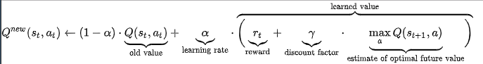

```{r setup, include=FALSE}
knitr::opts_chunk$set(echo = TRUE,echo=FALSE)
library(tidyverse)
```


## Introduction

This notebook explores the research and papers available on applying machine learning in manufacturing plants or large scale industrial applications.  

## Great summary journal

Here is a great summary paper written by:  

`Thorsten Wuest, Daniel Weimer, Christopher Irgens & Klaus-Dieter Thoben`  

<https://www.tandfonline.com/doi/full/10.1080/21693277.2016.1192517>  

## Known applications of ML in manufacturing

From the journal:  

```{r}
known_ML = data.table::fread("../../static/data/AI_in_manufacturing/example_ML_industry.csv")

known_ML %>% knitr::kable()
```

So common tools listed are:  

- SVM in high dimensional data  
- Supervised learning for function approximation  
- Adaptive AI  
- Exploritory analysis to improve current implementation  
- Detecting correlations and causal inference  


What this summary lacks is some detail around the implementation of reinforcement learning in industry.  

## Blog on the state of Reinforcement learning in industry

This blog highlights some of the challenges and benefits of using reinforcement learning in practice:  

<https://www.oreilly.com/ideas/practical-applications-of-reinforcement-learning-in-industry>  

Key points:  

> "So, at least for now, RL may not be ideal for mission-critical applications that require continuous control."  

> "Industrial automation is another promising area."  

These seem somewhat contradicting...  

So if industrial automation is promising, why can't we seem to manage continuous control applications?  

## Use cases for RL

From the journal:  

<https://www.tandfonline.com/doi/full/10.1080/21693277.2016.1192517>  

<!--  -->

And the journal further lists the following use cases:  

> You’re using simulations because your system or process is too complex (or too physically hazardous) for teaching machines through trial and error.  

>You’re dealing with large state spaces.  

>You’re seeking to augment human analysts and domain experts by optimizing operational efficiency and providing decision support.  

## Choosing the ML solution

From these journals the different ML methods are summarised on the following diagram:  

<!--  -->

## Deep Reinforcement Learning in Practice

This paper is an example of successful DRL in practice:  

<https://sites.ualberta.ca/~pilarski/docs/papers/Gunther_2014_ProcediaTechology.pdf>  

Authors:  

> Johannes Günthera*, Patrick M. Pilarskib, Gerhard Helfricha, Hao Shena, Klaus Diepolda  

### Introduction - Q learning

DQN is the most basic implementation of Q-learning using a deep neural network.  

The idea behind q-learning is to establish a value to action mapping for every state an AI agent can encounter.

See wikipedia:  
<https://en.wikipedia.org/wiki/Q-learning>  

The basic formula for Q-learning is the quality function:  

<!--  -->

Here we evaluate the quality of every action for a given state ($a_t,s_t$). The previous believed value of this action is updated using the observed reward + a discounted estimate of the future value of this action.  

#### Now introduce neural networks

The traditional method requires one to construct a Q-matrix storing each $a_t,s_t$ pair.  

This becomes unmanageable and inefficient when the problem space is large. How then do we create a model based approximation of an arbitrarily complicated action-state space?  

How do we solve any function in 2018? We use function approximation using deeplearning!  

By turning the environment into an ndarray we can pass the environment to a deep neural network everytime we observe the state and environment change.  

Furthermore, using deep neural networks allows us to use more general types of inputs since data like images can be converted to ndarrays.  

For simulations like atari games the ndarray would be the screen output for each action together with a reward. This would be a 3 dimensional array of the form (height,width,color-channel). That is; for each pixel on the screen a Red, Blue and Green value.  

### Example DQN using keras with python

Here is an excelent blog by `Adrien Lucas Ecoffet`:  

<https://becominghuman.ai/lets-build-an-atari-ai-part-1-dqn-df57e8ff3b26>  

And here is a great blog by blogger keon:  

<https://keon.io/deep-q-learning/>  

You can run the code on your machine if you have keras and gym installed. I recommend running this on ubuntu.

### Example advanced PPO implementations PyTorch

Here is a great post on using pytorch to implement proximal policy optimization from the OpenAI baselines:  

<https://github.com/ikostrikov/pytorch-a2c-ppo-acktr/blob/master/algo/ppo.py>  

### Using OpenAI Baselines

OpenAI provides common Reinforcement Learning implementations in python with tensorflow.  

See:  

<https://blog.openai.com/openai-baselines-dqn/>  

The purpose of the baselines is to handle the initial construction of a learning framework so that the researcher can focus on improving and innovating upon solid baselines.  

### Bridging the gap between games and industry

Here is a great talk from the `O'Reilly Artificial Intelligence Conference 2017 - San Francisco, CA by O'Reilly Media, Inc.`  

<https://www.oreilly.com/library/view/oreilly-artificial-intelligence/9781491985250/video314925.html?utm_source=oreilly&utm_medium=newsite&utm_campaign=20171129_ben_lorica_reinforcement_learning_in_industry_related_resources_deep_reinforcement_learning_in_the_enterprise_link>  

