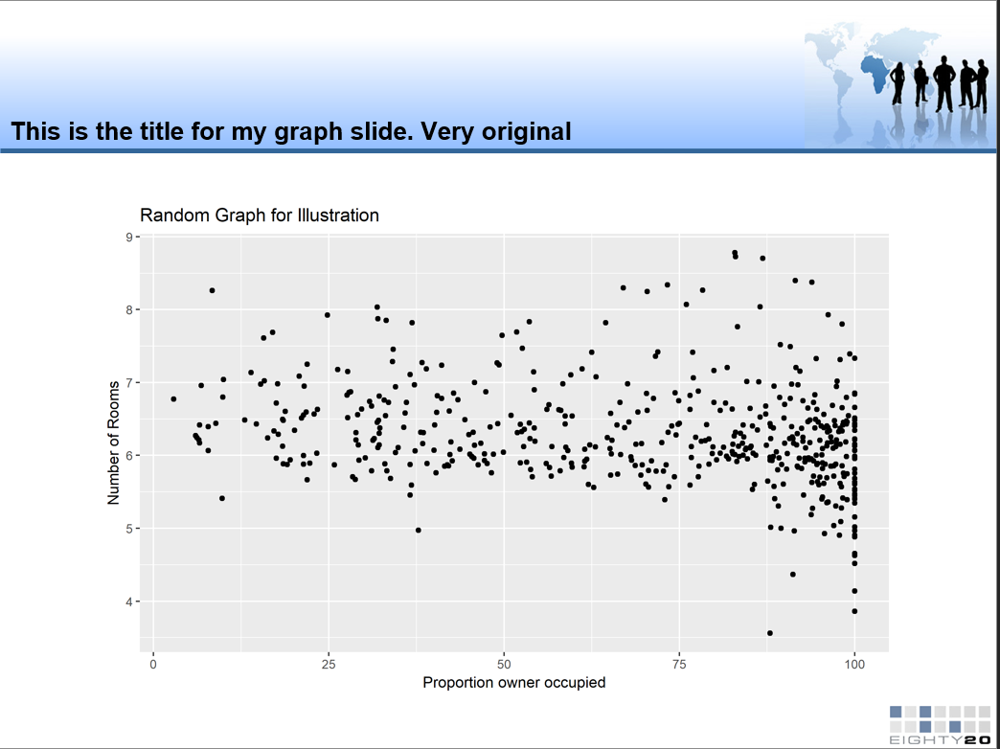

# Prelude and set up
In this markdown I will explain how to use OfficeR to generate powerpoint presentations.

The rmsfuns package was useful just to use the 'load_pkg' function which makes it easier to load multiple packages.
Firstly, you need the OfficeR package. I am also using the extrafont package in order to use Tahoma in the powerpoint, according to the Eighty20 template. The flextable package is necessary for tables in OfficeR, while lubridate helps with using dates. I will be using the MASS dataset simply for illustration. The difficulty with the flextable package is that it doesn't work in the linux environment (at least not yet) and so if you need to make flextables in your powerpoint deck, you won't be able to use the servers.
```{r load, message=FALSE, results='hide', warning=FALSE}
library(rmsfuns)
load <-
  c("officer", "MASS", "tidyverse", "lubridate", "extrafont", "flextable")
load_pkg(load)

# Explicitly specify the working directory, and import the correct font
wd <- getwd()
font_import(pattern = "tahoma.ttf", prompt = FALSE)
windowsFonts(Tahoma=windowsFont("TT Tahoma")) 
```

# Pre-reqs
Making a powerpoint deck in OfficeR requires a powerpoint template. This template can be made using the "slide master" functionality within powerpoint. OfficeR will then populate those templates. It can also be nice to have a pre-created title slide that has any unique elements that you want to include, but this is not necessary.

My template has a pre-created but unpopulated title slide.

# Stuff for the deck 
The cool thing about officeR is that you don't have to use it to create anything except the slides and deck itself. So create text, visualisations, etc exactly as you normally would in R in ggplot.

I know that my first slide will contain text. It's usually an agenda slide or some such, so here is the text that I want on my first non-title slide. OfficeR also supports indented sub-paragraphs, so I create my second paragraph as it's own text object.
```{r text}
random_text <- 
"Here I have random text
It even covers multiple lines
Maybe it should be my lymerick
That I didn't ever submit"

second_random_paragraph <- 
"Here I've added a random second paragraph
This paragraph is indented
Just to indicate a small amount of what can be done with text
in OfficeR"
```

Here is a basic plot to include.
```{r visuals}
data("Boston")

graph <- ggplot(data = Boston) +
  geom_point(mapping = aes(x = age, y = rm)) + 
  labs(x = "Proportion owner occupied", y = "Number of Rooms",
       title = "Random Graph for Illustration")

graph
```


OfficeR can also do tables, but requires use of the "flextable" package to make flextables.
I created this function that will format any table I create into a good looking flextable. It gives the text different sizes and fonts and colours depending of if they're in the body or the header, and it highlights every second row.
The function bg changes the background colour, specified by the argument bg. I used codes that matched colours that match the Eighty20 template as much as I could.
The border function allows you to adjust border thickness, colour, and style. 
The style argument deals with the text within the table.
```{r basicflextable_formatting}
## These define the text style for headers and body in tables
headerstyle <- fp_text(color = "white", font.size = 14, bold = TRUE, italic = FALSE, underlined = FALSE, 
                       font.family = "Tahoma")
bodystyle <- fp_text(color = "black", font.size = 12, bold = FALSE, italic = FALSE, underlined = FALSE, 
                       font.family = "Tahoma")

#This function provides basic formatting to the table. Background colouring, font, font size, alignment etc
format_flextable <- function(table_toformat) {
  rowcount <- nrow(table_toformat)
  columncount <- ncol(table_toformat)
  table_toformat <- flextable(table_toformat, col_keys = names(table_toformat))
  table_toformat <- bg(table_toformat, i = 1, j = 1:columncount, bg = "#345598", part = "header")
  for (k in 1:(rowcount/2)) {
    table_toformat <- bg(table_toformat, i = (k*2 -1), j = 1:columncount, bg = "#99aacb", part = "body")
    table_toformat <- bg(table_toformat, i = (k*2), j = 1:columncount, bg = "#c1ccdf", part = "body")
  }
  table_toformat <- align(table_toformat, i = 1, j = 1:columncount, align = "center", part = "header")
  table_toformat <- align(table_toformat, i = 1:rowcount, j = 1:columncount, align = "left", part = "body")
  
  table_toformat <- style(table_toformat, i = 1, j = 1:columncount, pr_t = headerstyle, part = "header")
  table_toformat <- style(table_toformat, i = 1:rowcount, j = 1:columncount, pr_t = bodystyle, part = "body")
  
  table_toformat <- border(table_toformat, i = 1, j = 1:columncount, border.top = fp_border(color = "white"),
                           border.bottom = fp_border(color = "white", width = 4),
                           border.left = fp_border(color = "white"), border.right = fp_border(color = "white"),
                           part = "header")

  table_toformat <- border(table_toformat, i = 1:rowcount, j = 1:columncount, border.top = fp_border(color = "white"),
                           border.bottom = fp_border(color = "white"), border.left = fp_border(color = "white"),
                           border.right = fp_border(color = "white"), part = "body")
  
  table_toformat <- height(table_toformat, i = 1, height = 0.5, part = "header")
  
  return (table_toformat)
}
```


Here I create a random table for illustrative purposes, and then format it into a beautiful flextable using the function above. I subsequently resize it as necessary for this particular table. The right sizing for your own tables will need to be discovered by trial and error. The cool thing is that you can resize on a column by column and row by row basis, using the width and height functions.
```{r randomtable}
random_table <- rbind(c("Row 1", 4, 5, 7),
                      c("Row 2", 1, 3, 9),
                      c("Row 3", 2, 6, 8),
                      c("Row 4", 10, 19, 432),
                      c("Row 5", 2, 6, 8),
                      c("Row 6", 2, 6, 8),
                      c("Row 7", 2, 6, 8),
                      c("Row 8", 2, 6, 8)) %>% 
  tbl_df()

names(random_table) <- c("ColumnHead1", "ColumnHead2", "ColumnHead3", "ColumnHead4")

random_table <- format_flextable(random_table)
random_table <- width(random_table, j = 1:4, width = 1.5)
random_table <- height_all(random_table, 0.5, part = "all")
random_table
```


# Actual OfficeR

Now that we have the text, graph, and table that we want to use for our deck, lets get to actually using OfficeR and creating the deck.

First, we create a powerpoint object by reading in an existing template file. 
```{r template}
deck <- read_pptx("../../static/data/Office_R/inputs/blog_template.pptx")
```

We proceed to edit the title slide. 
In the template the only slide that exists currently is a blank title slide. Using ph_add_text I can append text into the ctrTitle textbox and the subTitle textbox to complete the title slide.
```{r TitleSlide}
deck <- 
  deck %>%
  ph_add_text(style = fp_text(font.size = 16, font.family = "Tahoma"), 
              pos = "before", type = "ctrTitle", 
              str = "Analytics Team Blog: OfficeR") %>% 
  ph_add_text(style = fp_text(font.size = 18, font.family = "Tahoma"), 
              pos = "before", type = "subTitle", 
              str = paste(day(Sys.Date()), " ", month(Sys.Date(), label = TRUE, abbr = FALSE), ", ", year(Sys.Date()), sep = ""))
```

This is what the title slide created above would look like:

<!-- # ```{r titleslide, echo=FALSE, fig.cap="Title Slide", out.width = '100%'} -->
<!-- # knitr::include_graphics("../../static/data/Office_R/inputs/TitleSlide.PNG") -->
<!-- # ``` -->

   
   

Next, we add a slide containing only text. For this I am going to want to choose a slide from the template and add it. I choose the Title and content slide from the template. the ph_with_text function adds text into an allocated space in the template. I struggled to get this to work properly, but found a really easy work around. Use it to add an empty string into the space, and then append your text to that empty string using ph_add_text. ph_add_par creates the second paragraph I referred to earlier.
```{r Agenda}
# Create a text properties object
text_head <- fp_text(font.size = 12, font.family = "Tahoma")

deck <-
  deck %>% 
  add_slide(layout = "Title and Content", master = "Template_2012") %>% 
  ph_with_text(type = "body", str = "") %>% 
  ph_add_text(type = "body", str = random_text, style = fp_text(font.size = 20, font.family = "Tahoma")) %>%
  ph_add_par(level = 2) %>% 
  ph_add_text(type = "body", str = second_random_paragraph,
              style = fp_text(font.size = 18, font.family = "Tahoma")) %>% 
  ph_with_text(type = "title", str = "") %>% 
  ph_add_text(type = "title", str = "Heading for Text Slide", style = fp_text(font.size = 24, font.family = "Tahoma (Headings)"))

```

This is what the text slide created above would look like:
<!-- # ```{r textslide, echo=FALSE, fig.cap="Text Slide", out.width = '100%'} -->
<!-- #  -->
<!-- # ``` -->


Now here in this third slide I include the graph we created earlier. I find it easier to use ph_with_gg_at to place your visualisation precisely where you want it (with a little trial and error). The argument "left" places it as far from the left side of the slide as you define, while the argument "top" places it as far from the top as you define. height and width define the plot size.
```{r twobarslide}
deck <- 
  deck %>% 
  add_slide(layout = "Title and Content", master = "Template_2012") %>% 
  ph_with_text(type = "title", str = "") %>% 
  ph_add_text(type = "title", str = "This is the title for my graph slide. Very original") %>% 
  ph_with_gg_at(value = graph, left = 1, top = 2, height = 5, width = 8)
```

This is what the graph slide created above would look like:
<!-- # ```{r graphslide, echo=FALSE, fig.cap="Graph Slide", out.width = '100%'} -->
<!-- #  -->
<!-- # ``` -->


Here we include tables. It works much the same way as including graphs, only using ph_with_flextable_at.
```{r secondcreative_slide}
deck <- 
  deck %>% 
  add_slide(layout = "Title and Content", master = "Template_2012") %>% 
  ph_with_text(type = "title", str = "") %>% 
  ph_add_text(type = "title",
              str = "This is the title of the slide that contains my table. Even more original") %>%
  ph_with_flextable_at(value = random_table, left = 1, top = 2)
```

This is what the table slide created above would look like:
<!-- # ```{r tableslide, echo=FALSE, fig.cap="Table Slide", out.width = '100%'} -->
<!-- #  -->
<!-- # ``` -->


Now that we have created a powerpoint object that contains slides with text, graphs and tables we need to use it to actually create the powerpoint deck. That is done with this code:
```{r}
print(deck, target = "../../static/data/Office_R/output/deck.pptx") %>% 
  invisible()
```


Now that it's all done, check the output directory and see your beautiful new automated powerpoint deck.
